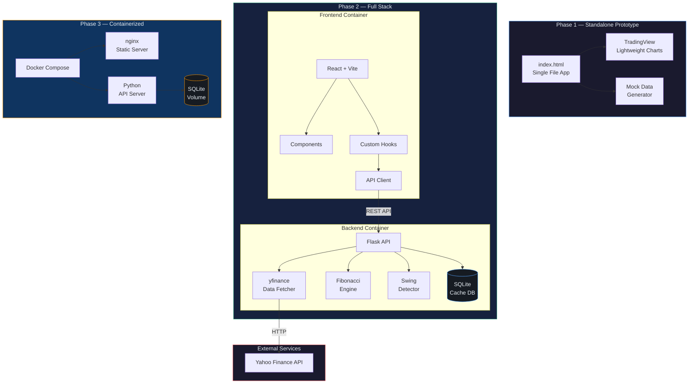
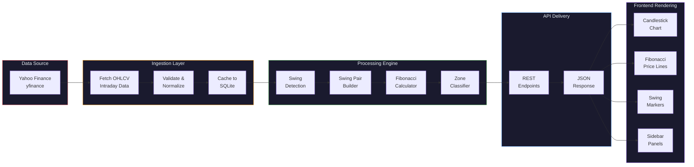
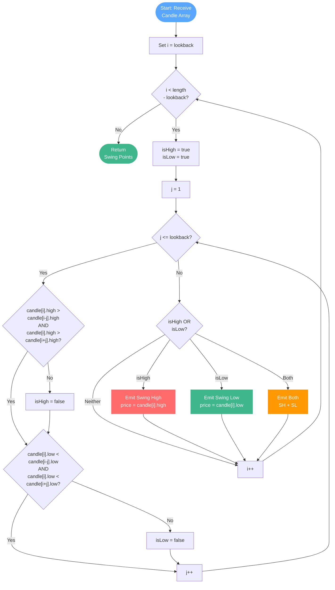
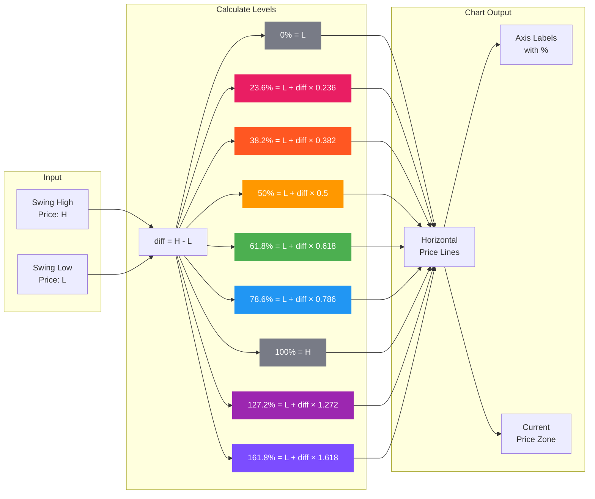
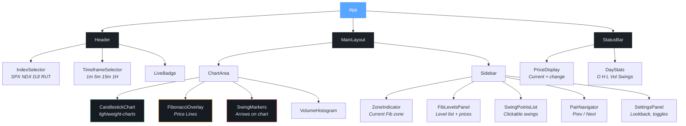
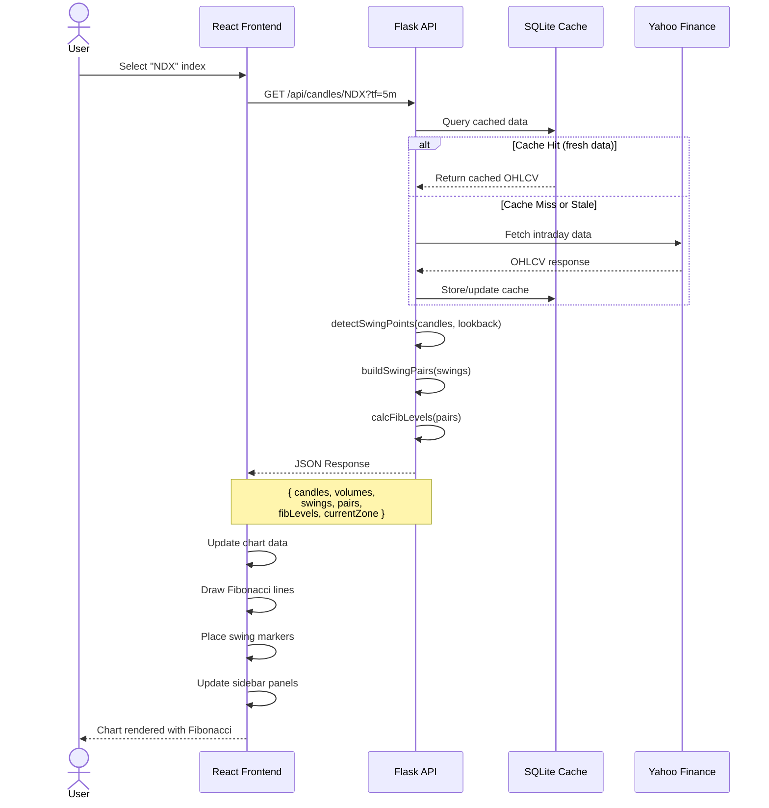
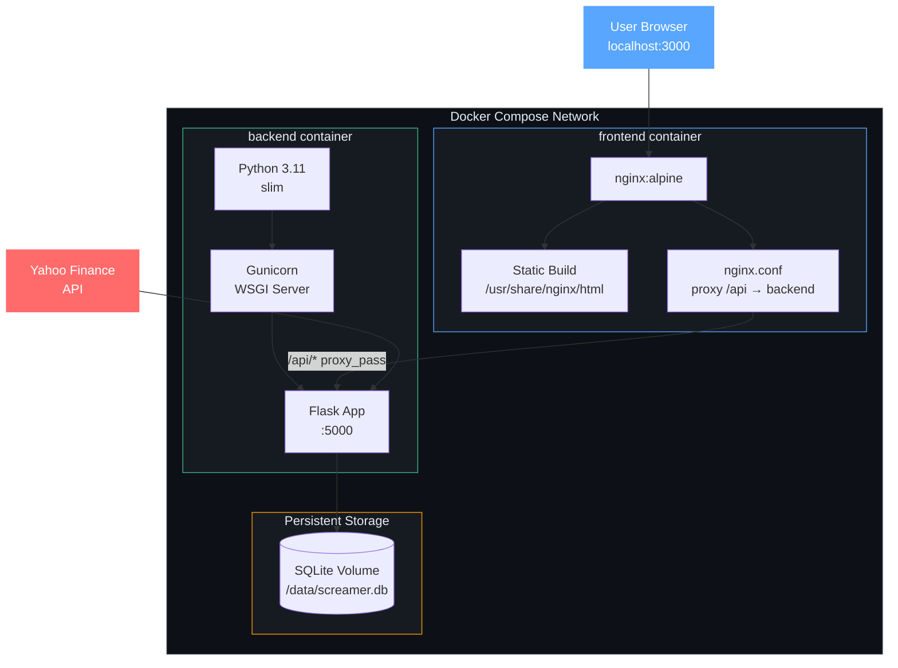
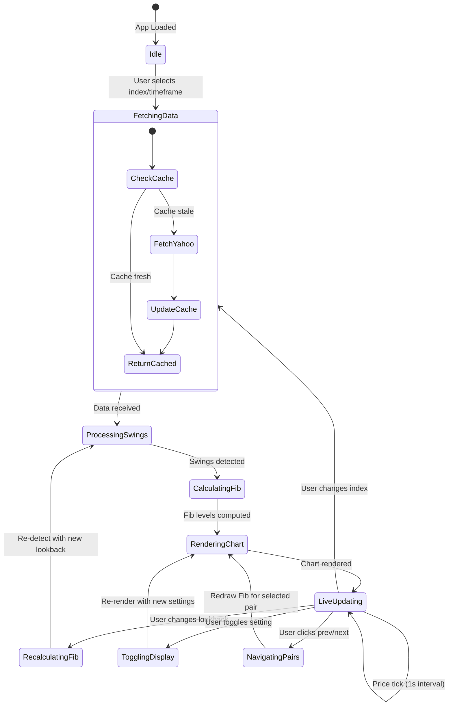
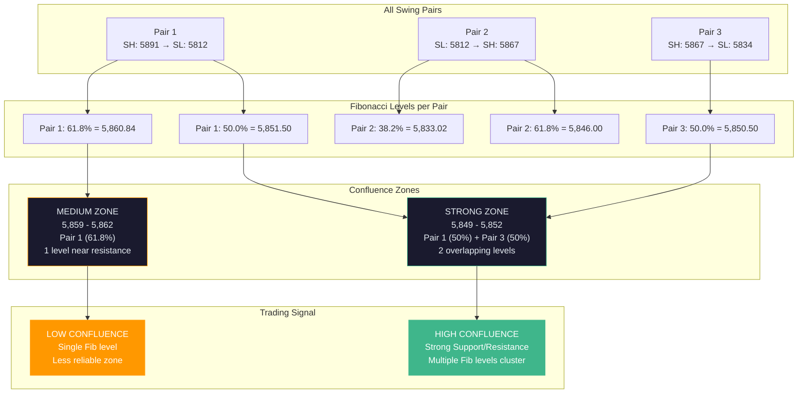

# Money Screamer — Architecture Diagrams

## 1. System Architecture Overview

## 2. Data Pipeline

## 3. Swing Detection Algorithm

## 4. Fibonacci Calculation

## 5. React Component Architecture (Phase 2)

## 6. API Sequence — Loading an Index

## 7. Docker Infrastructure (Phase 3)

## 8. State Management Flow (Phase 2)

## 9. Fibonacci Confluence Detection (Phase 4)

